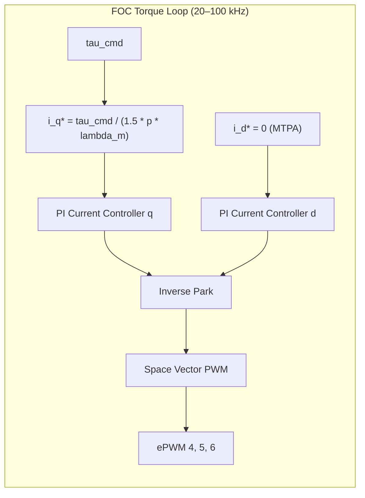
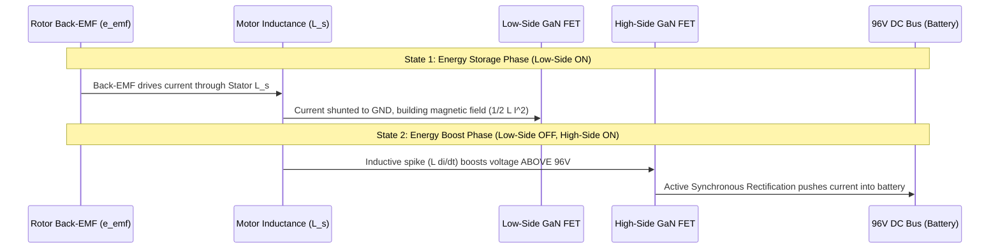

# Humanoid Drive Controller Architecture & Design: From Reinforcement Learning to GaN Field-Oriented Control

**Project:** 96V GaN Humanoid Leg Drive  
**Institution:** Queen's University, Kingston, Ontario  
**Author:** Nicholas Cusinato  
**Document Version:** 1.0  
**Date:** September 2026  

---

## Executive Summary

This document establishes the end-to-end multi-tier control architecture for the **96V GaN Humanoid Leg Drive**. The control framework bridges high-level energy-constrained reinforcement learning (RL) down to ultra-high-bandwidth Field-Oriented Control (FOC) running on distributed Gallium Nitride (GaN) motor drives.

Unlike traditional robotic drives—where actuators are treated as abstract, idealized torque sources and motor drives are developed in isolation on steady-state dynamometers—this architecture couples:
1. **Locomotion Dynamics:** Exploiting passive swing dynamics and variable mechanical impedance.
2. **Kinematic Contact Constraints:** Phase-based admittance control during foot impacts.
3. **Power Electronics Physics:** 4-quadrant synchronous boost regenerative braking, zero reverse-recovery ($Q_{\text{rr}} = 0$) eGaN switching, and bus-voltage-aware energy harvesting.

---

## 1. System Architecture & Control Hierarchy

The control system is organized into three hierarchical control loops, bounded by physical hardware at Level 0:

```mermaid
graph TD
    subgraph Level_1 ["Level 1: High-Level RL Policy & Trajectory Planner (~50 Hz)"]
        RL["Actor Network: a = [a_q, a_alpha]<br>• PPO-Lagrangian Energy Constraint (ECO)<br>• Alpha-Gated Passive Relaxation (Duke)<br>• Gait-Phase Regeneration Bonus"]
    end

    subgraph Level_2 ["Level 2: Whole-Body Control & Phase-Based Impedance (~1 kHz)"]
        WBC["MinimalWBC (Operational Space Control)<br>• Dynamic Stance Blending & Contact Scheduling<br>• Operational Space Tasks (Torso Pitch, CoM, Height)<br>• Phase-Based Admittance (Soft K_p, High K_d at Impact)<br>• Battery SoC Safety Clamp (>95%)"]
    end

    subgraph JointInterface ["Actuator Command Bus (EtherCAT >= 1 kHz)"]
        CMD["Joint Packet: { q*, q_dot*, K_p, K_d, tau_ff }"]
    end

    subgraph Level_3 ["Level 3: Joint Field-Oriented Control / FOC (20–100 kHz)"]
        FOC["TI TMS320F28069M MCU (C28x ISR @ PWM Rate)<br>• Decoupled d-q Current PI Loops (Pole-Zero Cancellation)<br>• MTPA Strategy (i_d* = 0 for SPMSM)<br>• Quadrant IV Synchronous Boost Regeneration"]
    end

    subgraph Level_0 ["Level 0: Power Stage & Actuator Physics"]
        HW["EPC91200 Inverter (EPC2305 eGaN FETs @ 96V)<br>• Active Synchronous Rectification (Zero Q_rr, 50 ns DT)<br>• Quasi-Direct Drive Actuator (AKE90 / AKE80 Motors)<br>• 105V Hardware Braking Chopper Failsafe"]
    end

    RL -->|Joint Targets q* & Activation alpha| WBC
    WBC -->|Compliant Joint Packet| CMD
    CMD -->|tau_cmd mapped to i_q*| FOC
    FOC -->|3-Phase PWM Gates (EPWM4-6)| HW
    HW -.->|Backdriven Mechanical Energy (Heel-Strike)| FOC
    FOC -.->|Regenerative Current Boost (I_bus)| HW
```

### Rate & Domain Summary

| Layer | Execution Host | Rate | Key Inputs | Key Outputs | Primary Responsibility |
| :--- | :--- | :--- | :--- | :--- | :--- |
| **Level 1: RL Policy** | Central Torso SBC / GPU | $\sim 50\text{ Hz}$ ($20\text{ ms}$) | Joint states $(q, \dot{q})$, IMU, base velocity, phase | Joint references $q^*$, activation multipliers $\alpha$ | Energy-optimal trajectory planning, passive swing discovery |
| **Level 2: WBC** | Real-Time Torso CPU | $\sim 1\text{ kHz}$ ($1\text{ ms}$) | High-level $q^*, \alpha$, floating-base kinematics, foot contacts | Joint torque command $\tau_{\text{cmd}}$, stiffness $K_p$, damping $K_d$ | Floating-base balance, contact scheduling, impact admittance |
| **Joint Bus** | Deterministic EtherCAT | $\ge 1\text{ kHz}$ | Synchronous frame packets | Packets to local MCUs | Synchronized distributed joint communication |
| **Level 3: FOC** | Distributed Joint MCUs (TI C2000) | $20\text{--}100\text{ kHz}$ ($10\text{--}50\ \mu\text{s}$) | $\tau_{\text{cmd}}$ (or $i_q^*$), phase currents $I_{u,v,w}$, rotor angle $\theta_e$ | Gate signals (ePWM 4/5/6) | Microsecond torque control, MTPA, synchronous boost regen |
| **Level 0: GaN Inverter** | EPC91200 + AKE Motors | Continuous | Gate drive pulses, DC bus voltage | Phase currents, shaft torque | Power switching, zero-$Q_{\text{rr}}$ commutation, energy recovery |

---

## 2. Level 1: Reinforcement Learning & Passive Policy Formulation

* **Primary Reference Files:** [passive_policy_research.md](file:///c:/96v_gan_humanoid_drive/MuJoCo/docs/passive_policy_research.md), [Regen Framework.md](file:///c:/96v_gan_humanoid_drive/MuJoCo/docs/Regen%20Framework.md)
* **Foundational Papers:**
  * **Duke Humanoid:** Xia, Li, Lee, Scutari, Chen (2024), *The Duke Humanoid: Design and Control For Energy-Efficient Bipedal Locomotion Using Passive Dynamics*, [arXiv:2409.19795v2](https://arxiv.org/abs/2409.19795).
  * **ECO:** Huang, Zhang, Li, Zhang, Wu, Wang, Liu, Yang, Su (IEEE T-ASE 2026), *ECO: Energy-Constrained Optimization With Reinforcement Learning for Humanoid Walking*.

### 2.1 The Problem with Standard RL in Energy Minimization
In conventional legged RL, an energy penalty is appended to the reward function:
$$R_{\text{total}} = R_{\text{tracking}} - \beta \sum_{j} |\tau_j \cdot \dot{q}_j|$$
When the penalty weight $\beta$ is set sufficiently high to reduce the Cost of Transport (CoT), the policy experiences **reward collapse**—the energy penalty overwhelms the motion reward, causing the robot to freeze, crouch, or fall to eliminate joint power.

### 2.2 Hybrid Constrained-Activation Architecture
Our framework resolves this by uniting Duke’s explicit action gating with ECO’s dual-constrained PPO formulation.

#### A. Expanded Action Space ($\mathbf{a}_t = [\mathbf{a}_q, \mathbf{a}_\alpha]$)
The actor network outputs two vectors per decision step:
1. $\mathbf{a}_q \in \mathbb{R}^{n_j}$: Joint position targets $q^*$.
2. $\mathbf{a}_\alpha \in [0, 1]^{n_j}$: Continuous per-joint activation parameter.

The applied joint control law is:
$$\tau_j = \alpha_j \cdot \Big( K_{p,j} (q_j^* - q_j) + K_{d,j} (\dot{q}_j^* - \dot{q}_j) \Big)$$

* When $\alpha_j \to 1$, the joint is stiff and active (e.g., stance push-off).
* When $\alpha_j \to 0$, the joint is completely compliant (e.g., knee swing phase), allowing natural ballistic pendulum motion without electrical energy expenditure.
* A soft inverse activation reward $r_\alpha = \frac{1}{\|\mathbf{a}_\alpha\|}$ encourages the network to minimize joint effort.

#### B. PPO-Lagrangian Energy Constraint (ECO Formulation)
Instead of statically tuning penalty coefficients, energy is treated as a strict mathematical constraint:
$$\max_{\theta} \; \mathbb{E} [R_{\text{motion}}] \quad \text{subject to} \quad \mathbb{E} [C_{\text{energy}}] \le \epsilon_{\text{target}}$$
where the cost is absolute mechanical work:
$$C_{\text{energy}} = \sum_{j=1}^{n_j} |\tau_j \cdot \dot{q}_j|$$

The optimization updates policy weights $\theta$ and the dual Lagrange multiplier $\lambda$ via dual gradient descent:
$$\mathcal{L}(\theta, \lambda) = \mathbb{E}[R_{\text{motion}}] - \lambda \Big(\mathbb{E}[C_{\text{energy}}] - \epsilon_{\text{target}}\Big)$$
$$\lambda_{k+1} = \max\Big(0, \, \lambda_k + \eta_{\text{dual}} \big(\mathbb{E}[C_{\text{energy}}] - \epsilon_{\text{target}}\big)\Big)$$
If the energy exceeds $\epsilon_{\text{target}}$, $\lambda$ increases automatically, forcing the policy back into compliance without manual retuning or collapse.

#### C. Hardware-Aware Regeneration Incentivization
To exploit the 96V GaN drive's 4-quadrant capability:
1. **Gait-Phase Gating:** Harvesting is incentivized only during negative work phases (heel-strike impact and swing deceleration).
2. **Impact Yielding Bonus:** The policy receives an extra reward for dropping $\alpha \approx 0$ during foot contact, teaching the robot to yield to the impact so the rotor is backdriven.
3. **Regen Lower Bound:** A secondary Lagrangian constraint $\mathbb{E}[C_{\text{regen}}] \ge \epsilon_{\text{regen}}$ compels the policy to discover trajectories that return a non-zero energy quota back to the battery.

---

## 3. Level 2: Whole-Body Control & Phase-Based Impedance Mapping

* **Primary Reference Files:** [wbc_controller.py](file:///c:/96v_gan_humanoid_drive/MuJoCo/controllers/wbc_controller.py), [kbot_leg_control_math.md](file:///c:/96v_gan_humanoid_drive/docs/kbot_leg_control_math.md), [gait_generator.py](file:///c:/96v_gan_humanoid_drive/MuJoCo/controllers/gait_generator.py)

### 3.1 Reduced Floating-Base Dynamics
The full equation of motion for the humanoid is:
$$M(q)\dot{v} + c(q,v) + g(q) = S^T \tau + J_c(q)^T \lambda_c$$
* $M(q) \in \mathbb{R}^{n_v \times n_v}$: Generalized mass matrix.
* $c(q,v) + g(q) = \text{qfrc\_bias}$: Coriolis, centrifugal, and gravitational forces.
* $S = [0_{n_j \times 6}, \, I_{n_j \times n_j}]$: Actuation selection matrix.
* $J_c(q)^T \lambda_c$: Contact wrenches at the feet.

### 3.2 Operational Space Tasks & Jacobian Transpose Mapping
The [MinimalWBC](file:///c:/96v_gan_humanoid_drive/MuJoCo/controllers/wbc_controller.py#L6) executes three prioritized tasks in Cartesian operational space:

#### 1. Torso Pitch Stabilization Task
Maintains upright posture without over-constraining the legs:
$$F_{\text{pitch}} = \Lambda_{\text{pitch}} \Big( K_{p,\theta} (\theta^* - \theta) - K_{d,\theta} \dot{\theta} \Big)$$
$$\tau_{\text{pitch}} = (J_{r,\text{torso}} - J_{r,\text{support}})^T F_{\text{pitch}}$$
where $\Lambda_{\text{pitch}} = m_{\text{total}} h_{\text{com}}^2$ is the operational space inertia about the feet.

#### 2. Center of Mass (CoM) Translational Task
Stabilizes the projection of the CoM over the active support foot:
$$F_{\text{CoM},xy} = \Lambda_{\text{CoM}} \Big( K_{p,xy} (x_{\text{CoM}}^* - x_{\text{CoM}}) - K_{d,xy} \dot{x}_{\text{CoM}} \Big)$$
$$\tau_{\text{CoM}} = (J_{p,\text{CoM}} - J_{p,\text{support}})^T F_{\text{CoM},xy}$$

#### 3. Active Vertical Height & Gravity Feedforward
$$F_z = m_{\text{total}} g + \Lambda_z \Big( K_{p,z} (z_{\text{torso}}^* - z_{\text{torso}}) - K_{d,z} \dot{z} \Big)$$
$$\tau_{\text{vertical}} = (J_{p,z,\text{torso}} - J_{p,z,\text{support}})^T F_z$$

### 3.3 Contact Scheduling & Dynamic Stance Blending
Foot contact height difference ($\Delta z = z_{\text{right}} - z_{\text{left}}$) dynamically computes an alpha-blending factor $\alpha_{\text{stance}} \in [0, 1]$:
$$J_{\text{support}} = \alpha_{\text{stance}} J_{\text{left}} + (1 - \alpha_{\text{stance}}) J_{\text{right}}$$
This guarantees continuous Jacobian transitions without discontinuous torque chatter during double-to-single support switches.

### 3.4 Phase-Based Admittance for Impact Regeneration
During impact phases (heel-strike and jump landing):
* Virtual stiffness drops: $K_p \rightarrow 0.05 \times K_{p,\text{nom}}$
* Virtual damping spikes: $K_d \rightarrow 1.5 \times K_{d,\text{nom}}$
* Resulting control law: $\tau \approx -K_d \dot{\theta}$.
* The joint acts as a linear viscous absorber. The external impact backdrives the rotor against the damping torque, transforming mechanical impact shock directly into electrical regenerative current.

### 3.5 Battery State of Charge (SoC) Clamp
If the battery SoC exceeds $95\%$, the WBC mathematically saturates negative torque:
$$\tau_{\text{cmd}} = \max\Big(\tau_{\text{cmd}}, \, -\tau_{\text{regen\_max}}(SoC)\Big)$$
This prevents pushing power into a saturated battery pack or triggering BMS overvoltage disconnects.

---

## 4. Actuator Command Bus Interface

Commands passed from Level 2 (Torso WBC) to Level 3 (Joint MCU) over EtherCAT conform to the compliant actuator packet:
$$\text{Packet} = \Big\{ q^*, \; \dot{q}^*, \; K_p, \; K_d, \; \tau_{\text{ff}} \Big\}$$

The joint MCU computes the total torque command:
$$\tau_{\text{cmd}} = \tau_{\text{ff}} + K_p (q^* - q) + K_d (\dot{q}^* - \dot{q})$$
This allows the local MCU to execute joint impedance loops at high bandwidth if EtherCAT communication experiences jitter.

---

## 5. Level 3: Field-Oriented Control (FOC) Architecture

* **Primary Reference Files:** [FOC_Motor_Control_Params.m](file:///c:/96v_gan_humanoid_drive/phase1/simulation/MyFOC%20code/FOC_Motor_Control_Params.m), [VirtualSpeedDynoParams.m](file:///c:/96v_gan_humanoid_drive/phase1/simulation/VirtualSpeedDynoParams.m), [matlab_simulink_foc_guide.md](file:///c:/96v_gan_humanoid_drive/phase1/simulation/matlab_simulink_foc_guide.md)
* **Target Hardware:** Texas Instruments TMS320F28069M (90 MHz C28x Piccolo DSP) + EPC9147B Interface + EPC91200 Inverter.

### 5.1 FOC Control Level & Operating Modes
The FOC core is fundamentally a **Torque (Phase Current) Controller**:



* **Dynamic Humanoid Mode:** The FOC executes purely as a high-bandwidth torque controller. The outer impedance/position loops are handled upstream in WBC and RL.
* **Bench Dyno Mode:** An optional outer speed PI loop ($1\text{ kHz}$) is activated to hold rotor velocity against load during motor characterization sweeps:
  $$i_q^* = K_{p,\text{spd}} (\omega^* - \omega) + K_{i,\text{spd}} \int (\omega^* - \omega) dt$$

### 5.2 Transformations & Rotor Orientation
1. **Current Sensing:** Measured via Allegro `ACS37003LLUTR-050B3` Hall-effect ICs ($12\text{ mV/A}$, $1.65\text{ V}$ midpoint bias):
   $$I_{\text{phase}} = \left(\frac{\text{ADC Counts} - 2048}{2048}\right) \times 137.5\text{ A}$$
2. **Clarke Transform ($abc \rightarrow \alpha\beta$):**
   $$i_\alpha = i_a, \qquad i_\beta = \frac{1}{\sqrt{3}} (i_a + 2 i_b)$$
3. **Park Transform ($\alpha\beta \rightarrow dq$):**
   $$\begin{bmatrix} i_d \\ i_q \end{bmatrix} = \begin{bmatrix} \cos\theta_e & \sin\theta_e \\ -\sin\theta_e & \cos\theta_e \end{bmatrix} \begin{bmatrix} i_\alpha \\ i_\beta \end{bmatrix}$$
   where $\theta_e = p \cdot \theta_m$ is electrical angle from the AS5047P encoder via the hardware `eQEP` module ($1024\text{ PPR} \rightarrow 4096\text{ counts/rev}$).

### 5.3 Maximum Torque Per Ampere (MTPA)
Because the AKE80 and AKE90 are Surface Permanent Magnet Synchronous Motors (SPMSM) with surface-mounted magnets, saliency is negligible:
$$L_d \approx L_q = L_s$$
The electromagnetic torque is:
$$\tau_e = \frac{3}{2} p \Big( \lambda_m i_q + (L_d - L_q) i_d i_q \Big) = \frac{3}{2} p \lambda_m i_q$$
Reluctance torque is zero. Therefore, MTPA strictly dictates:
$$i_d^* = 0, \qquad i_q^* = \frac{\tau_{\text{cmd}}}{\frac{3}{2} p \lambda_m}$$
This eliminates reactive current, minimizes stator copper losses ($P_{\text{Cu}} = 3 I_{\text{RMS}}^2 R_s$), and prevents winding overheating.

### 5.4 Decoupled Current Loop PI Design (Pole-Zero Cancellation)
The stator voltage equations in the rotor frame are:
$$v_d = R_s i_d + L_d \frac{di_d}{dt} - \omega_e L_q i_q$$
$$v_q = R_s i_q + L_q \frac{di_q}{dt} + \omega_e L_d i_d + \omega_e \lambda_m$$

Current loop bandwidth is designed for $\omega_c = 2\pi (f_{\text{sw}} / 10)$. Using pole-zero cancellation ($\frac{K_i}{K_p} = \frac{R_s}{L_s}$):
$$K_{p,d} = L_d \omega_c, \quad K_{i,d} = R_s \omega_c; \qquad K_{p,q} = L_q \omega_c, \quad K_{i,q} = R_s \omega_c$$

Cross-coupling decoupling and back-EMF feedforward terms are added to the PI outputs:
$$v_d^* = v_{d,\text{PI}} - \omega_e L_q i_q$$
$$v_q^* = v_{q,\text{PI}} + \omega_e L_d i_d + \omega_e \lambda_m$$

### 5.5 Space Vector PWM (SVPWM)
$v_d^*, v_q^*$ are transformed back to stationary coordinates ($v_\alpha^*, v_\beta^*$) via Inverse Park. Space Vector PWM calculates sector dwell times:
* Maximizes DC bus utilization by $15.5\%$ compared to standard sine-triangle PWM without entering overmodulation.
* Center-aligned symmetrical PWM suppresses odd current harmonics, reducing motor core iron losses.

---

## 6. Level 0: 96V GaN Inverter & Physical Actuation Layer

* **Hardware Reference:** EPC91200 evaluation board with EPC2305 eGaN FETs + EPC23102 gate drivers.
* **Actuators:** Custom AKE90-KV35 (knee and hip) and AKE80-8 (ankle surrogate) Quasi-Direct Drive (QDD) actuators.

### 6.1 Quadrant IV Synchronous Boost Regeneration
When torque opposes rotor velocity ($\tau_{\text{cmd}} \cdot \omega_m < 0$, meaning $i_q^* \cdot \omega_e < 0$), the FOC operates in **Quadrant IV** (generating/braking mode):



* **Synchronous Rectification:** Because GaN switches bidirectional current with near-zero on-resistance ($R_{\text{DS(on)}} = 2.2\text{ m}\Omega$), turning ON the reverse channel eliminates the forward diode conduction voltage drop ($V_F \approx 0.7\text{--}1.2\text{V}$ in Si body diodes), boosting regeneration round-trip efficiency by $5\text{--}12\%$.

### 6.2 The GaN Advantages in Motor Drives

#### 1. Zero Reverse-Recovery Charge ($Q_{\text{rr}} = 0$)
Silicon MOSFETs suffer from minority carrier storage in their parasitic body diodes. During hard commutation, reverse recovery creates high peak shoot-through currents, excessive switching losses ($P_{\text{sw}} \propto Q_{\text{rr}} V_{\text{bus}} f_{\text{sw}}$), and severe ringing. EPC2305 eGaN FETs have **zero reverse recovery**, enabling clean switching up to $100\text{ kHz}$.

#### 2. Ultra-Short Deadtime ($50\text{ ns}$ vs $500\text{ ns}$)
In Silicon inverters, long deadtimes ($300\text{--}500\text{ ns}$) distort low-voltage PWM waveforms, creating non-linear deadtime voltage errors:
$$\Delta V = \text{sign}(i_{\text{phase}}) \cdot f_{\text{sw}} \cdot t_{\text{dead}} \cdot V_{\text{bus}}$$
At 96V, this distortion creates torque ripple, low-speed cogging, and limits current loop bandwidth. GaN’s $50\text{ ns}$ deadtime reduces this distortion by $10\times$, dramatically improving backdrivability and dynamic range (Z-width).

#### 3. Conduction Loss Reduction at 96V
Doubling the bus voltage from 48V to 96V cuts the phase current in half for identical joint mechanical power ($P = \tau \omega$):
$$I_{\text{96V}} = \frac{1}{2} I_{\text{48V}}$$
Because stator copper loss scales with current squared:
$$P_{\text{Cu}} = 3 I^2 R_s \implies P_{\text{Cu, 96V}} \approx \frac{1}{4} P_{\text{Cu, 48V}}$$
This reduces stator Joule heating by up to $75\%$, allowing smaller, lighter actuators to run continuous walking cycles without thermal runaway.

### 6.3 Hardware Braking Chopper Failsafe
During aggressive landings, if the battery BMS isolates the pack due to cell overvoltage or high temperature, the DC bus will experience a rapid inductive surge ($V_{\text{bus}} = \frac{1}{C_{\text{dc}}} \int I_{\text{regen}} dt$). A fast hardware comparator circuit triggers at **$105\text{V}$**, pulsing a low-inductance planar dump resistor to clamp the bus below the $130\text{V}$ maximum rating of the EPC2305 FETs.

---

## 7. Comprehensive Literature & Codebase Mapping

### 7.1 Primary Literature References

| Citation / Identifier | Title & Authors | Key Architectural Role in This Project | Location in Repo |
| :--- | :--- | :--- | :--- |
| **Duke Humanoid**<br>(arXiv:2409.19795v2) | *The Duke Humanoid: Design and Control For Energy-Efficient Bipedal Locomotion Using Passive Dynamics*<br>Xia, Li, Lee, Scutari, Chen (2024) | Per-joint activation multiplier $\alpha \in [0, 1]$ and passive gating control law $\tau = \alpha \cdot \text{PD}(q^*, q)$ | [2409.19795v2.pdf](file:///c:/96v_gan_humanoid_drive/MuJoCo/Papers/2409.19795v2.pdf)<br>[Extracted Text](file:///c:/96v_gan_humanoid_drive/MuJoCo/Papers/extracted_text/2409.19795v2.txt) |
| **ECO**<br>(IEEE T-ASE 2026) | *ECO: Energy-Constrained Optimization With Reinforcement Learning for Humanoid Walking*<br>Huang, Zhang, Li, Zhang, Wu, Wang, Liu, Yang, Su (2026) | Constrained PPO-Lagrangian optimization separating energy into an adaptive inequality constraint $\mathbb{E}[C_{\text{energy}}] \le \epsilon$ | [ECO Paper.pdf](file:///c:/96v_gan_humanoid_drive/MuJoCo/Papers/ECO_Energy-Constrained_Optimization_With_Reinforcement_Learning_for_Humanoid_Walking.pdf)<br>[Extracted Text](file:///c:/96v_gan_humanoid_drive/MuJoCo/Papers/extracted_text/ECO_Energy-Constrained_Optimization_With_Reinforcement_Learning_for_Humanoid_Walking.txt) |
| **ROM in MPC**<br>(Chen 2024) | *Reinforcement Learning for Reduced-order Models of Legged Robots*<br>Chen, Bui, Posa (2024) | Reduced-order models and CoM momentum constraints integrated into operational space control | [Chen2024.pdf](file:///c:/96v_gan_humanoid_drive/MuJoCo/Papers/Chen2024.pdf)<br>[Extracted Text](file:///c:/96v_gan_humanoid_drive/MuJoCo/Papers/extracted_text/Chen2024.txt) |
| **Footstep Optimization**<br>(MERL / IROS 2025) | *Energy-Efficient Motion Planner for Legged Robots*<br>Schperberg, Menner, Di Cairano (2025) | Footstep placement sets and step-frequency timing bounds for minimal Cost of Transport (CoT) | [TR2025-151.pdf](file:///c:/96v_gan_humanoid_drive/MuJoCo/Papers/TR2025-151.pdf)<br>[Extracted Text](file:///c:/96v_gan_humanoid_drive/MuJoCo/Papers/extracted_text/TR2025-151.txt) |
| **GaN Power Converters**<br>(Phase 0 Review) | *High-Frequency Oriented Design of GaN Power Converters* | Analytical switching loss, reverse recovery comparisons, and thermal network parameters | [Literature PDF](file:///c:/96v_gan_humanoid_drive/phase0/literature/High-Frequency%20Oriented%20Design%20of%20GaN%20Power%20Converters.pdf) |

### 7.2 Internal Codebase Architecture Mapping

| Layer | Repository Source Files | Primary Classes / Functions |
| :--- | :--- | :--- |
| **RL & Locomotion** | [passive_policy_research.md](file:///c:/96v_gan_humanoid_drive/MuJoCo/docs/passive_policy_research.md)<br>[Regen Framework.md](file:///c:/96v_gan_humanoid_drive/MuJoCo/docs/Regen%20Framework.md) | Policy training specs, Lagrangian loss definitions |
| **Whole-Body Control** | [wbc_controller.py](file:///c:/96v_gan_humanoid_drive/MuJoCo/controllers/wbc_controller.py)<br>[kbot_leg_control_math.md](file:///c:/96v_gan_humanoid_drive/docs/kbot_leg_control_math.md) | `MinimalWBC`: `compute_torques()`, `solve_flat_foot_ankles()`, `solve_spawn_height()` |
| **Gait Generation** | [gait_generator.py](file:///c:/96v_gan_humanoid_drive/MuJoCo/controllers/gait_generator.py) | `GaitGenerator`: `_compute_stand_targets()`, `_compute_stepping_targets()`, `_compute_jump_targets()` |
| **FOC Simulation & Dyno** | [VirtualSpeedDynoParams.m](file:///c:/96v_gan_humanoid_drive/phase1/simulation/VirtualSpeedDynoParams.m)<br>[GaitTrackingSimulation.m](file:///c:/96v_gan_humanoid_drive/phase1/simulation/GaitTrackingSimulation.m) | Virtual dynamometer, efficiency contour mappings, frequency sweeps, tracking evaluations |
| **FOC Embedded Firmware** | [FOC_Motor_Control_Params.m](file:///c:/96v_gan_humanoid_drive/phase1/simulation/MyFOC%20code/FOC_Motor_Control_Params.m)<br>[matlab_simulink_foc_guide.md](file:///c:/96v_gan_humanoid_drive/phase1/simulation/matlab_simulink_foc_guide.md) | Pole-zero PI design, ADC scaling, ePWM4-6 hardware pinout, register configurations |
| **Test Matrix & Validation** | [professor_overview.md](file:///c:/96v_gan_humanoid_drive/docs/professor_overview.md)<br>[dyno_test_procedure_AKE80-8.md](file:///c:/96v_gan_humanoid_drive/docs/dyno_test_procedure_AKE80-8.md) | T1–T5 test definitions, bench supply safeguards, oscilloscope probe setups |

---

## 8. Summary of Novel Research Contributions

1. **Cross-Layer Hardware-In-The-Loop Co-Design:** Connects high-level reinforcement learning directly to real-time power electronics dynamics (switching loss, back-EMF boosting, and battery SoC constraints).
2. **Hybrid Duke + ECO Policy:** Unites continuous action-space activation multipliers ($\alpha \in [0, 1]$) with dual-gradient constrained optimization, achieving provably stable training with low Cost of Transport.
3. **Phase-Aware Impact Regeneration:** Uses whole-body admittance softening ($\tau \approx -K_d \dot{\theta}$) at foot impact to harvest negative work into an active synchronous rectification 96V GaN bus.
4. **Sub-Microsecond Zero-$Q_{\text{rr}}$ GaN Commutation:** Eliminates reverse recovery losses and deadtime voltage distortion via 50 ns switching, dramatically improving low-speed tracking transparency and system efficiency.
