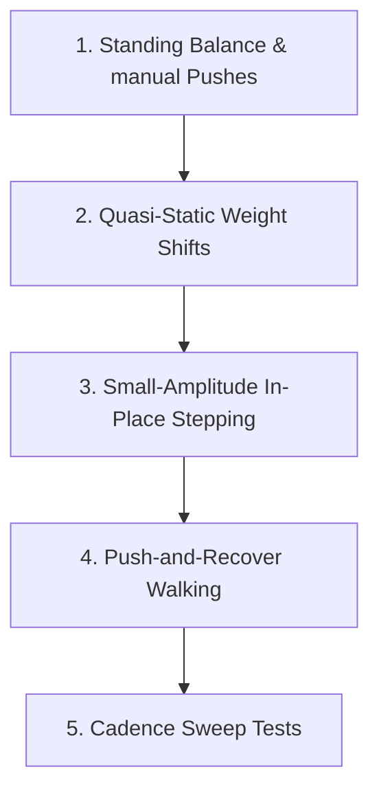

# ⚡ Phase 0: 96V GaN + QDD Humanoid Gait Setup & Design Principles

This document outlines the core architecture and testing methodology for our 96V GaN high-frequency switching drive and Quasi-Direct Drive (QDD) actuator stack on the **Kbot** humanoid robot. 

Rather than simply trying to "survive standing," our gait trajectories, Whole-Body Control (WBC) parameters, and test protocols are specifically designed to expose and exploit the unique electrical, thermal, and dynamic benefits of high-voltage GaN electronics and backdrivable mechanical QDDs.

---

## 🏎️ Hardware Paradigm Advantages

Our humanoid stack combines **96V high-voltage bus architecture**, **Gallium Nitride (GaN) motor drives**, and **Quasi-Direct Drive (QDD) actuators**. This grants several crucial advantages over traditional 48V, Silicon MOSFET, high-gear-ratio setups:

1. **High switching Frequency (GaN)**: Operating motor drives at extremely high PWM switching frequencies (e.g., 50–100 kHz) reduces current ripple, minimizes core losses, and allows high-bandwidth current/torque loop control.
2. **High Bus Voltage (96V)**: Busing at 96V drastically reduces RMS phase currents for the same mechanical power output ($P = I^2 R$ winding losses are reduced by 4x compared to 48V setups), leading to significantly cooler motor operation and less bus ripple.
3. **QDD Backdrivability**: Using low gear ratios (e.g., 6:1 to 10:1) minimizes reflected joint inertia ($J_{\text{reflected}} = N^2 J_{\text{rotor}}$) and joint friction/cogging. This makes the legs inherently compliant, safe, and highly responsive to ground impact.

---

## 🏃 QDD-Friendly Gait Design Principles

To highlight these advantages, our gait generation avoids stiff, locked-in industrial robot trajectories in favor of a **light, compliant, dynamic bipedal biped style**:

* **Knee & Ankle Compliance**: Soften physical joint gains and let the mechanical QDD backdrivability absorb foot strike shocks naturally.
* **Shorter Stance Phases & Agile Transitions**: Rather than heavy, slow, quasi-static walking, favor faster step frequencies with shorter stance times to showcase high-bandwidth current tracking.
* **Low CoM Excursions & Smooth Foot Arcs**: Minimize vertical CoM changes and employ smooth cycloidal swing foot trajectories to reduce peak joint torque demands.
* **Natural Dynamic Sway**: Allow controlled lateral/sagittal body sway, demonstrating how the high-frequency GaN drives make dynamic balance look elegant and compliant rather than sloppy.

---

## 🎮 Gait Demo Progression

We will implement a clean, step-by-step test progression to highlight our hardware advantages:

### 1. Standing Balance with Manual Pushes
* **Goal**: Validate high torque loop bandwidth and low current ripple.
* **Test**: Apply manual pushes/impulse forces in the visualizer and observe fast recovery times, clean current tracking, and lack of limit cycle oscillations.

### 2. Slow Quasi-Static Weight Shifts
* **Goal**: Demonstrate mechanical backdrivability and low friction/cogging.
* **Test**: Slowly shift target CoM in sagittal (X) and lateral (Y) planes. QDDs should slide and track with extreme low-current smoothness.

### 3. Small-Amplitude In-Place Stepping
* **Goal**: Prove precise tracking and dynamic compliance under contact state switches.
* **Test**: Short steps with low foot clearance, relying on joint compliance to absorb foot strike impacts.

### 4. Push-and-Recover Walking
* **Goal**: Show whole-body disturbance rejection with torque-controlled, backdrivable legs.
* **Test**: Sagittal and lateral perturbations during dynamic walking.

### 5. Cadence Sweep Tests
* **Goal**: Prove electrical efficiency and low thermal rise of the 96V GaN architecture.
* **Test**: Run walking gaits at various step frequencies and log electrical heating/losses.

---

## 📊 Key Performance Metrics to Log

To mathematically prove the value of our 96V GaN + QDD stack, our simulation and data logging pipeline will measure:

1. **RMS and Peak Joint Current ($I_{\text{RMS}}$, $I_{\text{peak}}$)**: To prove low winding losses and high thermal efficiency.
2. **Torque Tracking Error ($\tau_{\text{des}} - \tau_{\text{curr}}$)**: Verifying high torque bandwidth.
3. **Recovery Time ($t_{\text{recover}}$)**: Quantifying balance recovery speed after an impulse force.
4. **CoM Tracking Error**: Quantifying precision under dynamic shifting.
5. **Bus & Capacitor Ripple Current**: Proving high-voltage DC bus stability.
